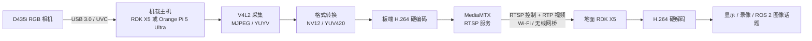

# D435i 到 RDK X5 地面站低延迟图传方案

## 1. 目标与默认配置

本方案用于将挂载在飞行器上的 Intel RealSense D435i 的 **RGB 画面**，实时传输到地面 RDK X5。深度、红外、IMU、点云不参与首版图传。

首版固定目标如下：

| 项目 | 默认值 | 原因 |
|---|---:|---|
| 相机输出 | RGB，640x480@30fps | 对无线带宽、编码负担和画面可用性较均衡 |
| 编码 | H.264 | 低延迟链路中的兼容性、调试性优先 |
| 码率控制 | CBR，2 Mbit/s 起步 | 为无线链路留出稳定、可预估的带宽 |
| GOP | 15 帧 | 30fps 下每约 0.5 秒一张恢复用关键帧 |
| B 帧 | 0 | 避免帧重排序带来的额外等待 |
| 服务端 | MediaMTX，运行于机载主机 | 提供固定 RTSP 地址，便于地面站、录像和调试 |
| 首选媒体传输 | RTSP 协商 + RTP/UDP | 优先实时性；网络受限时可切换 RTP/TCP |

> [!important] 结论
> D435i 是 USB 相机，不带 Wi-Fi，不会自己产生 RTSP 地址。它必须接到机载 RDK X5 或 Orange Pi 5 Ultra，由机载主机负责采集、编码和网络发送。

本文件中的硬编码器名称均以“实机检测结果”为准。芯片具备编解码能力不代表当前镜像一定安装了同名的 GStreamer 或 FFmpeg 插件，不能直接照搬其他系统的插件名。

## 2. 全链路架构



数据方向需要分开理解：

```text
地面站 -> 机载 MediaMTX：RTSP 的 OPTIONS、DESCRIBE、SETUP、PLAY 等控制请求
机载主机 -> 地面站：RTP 小包中的 H.264 视频数据
双方之间：RTCP 网络质量与时间同步报告（设备可能不完整支持）
```

### 2.1 机载主机选择与本项目决策

| 机载主机 | 已知硬件能力 | 图传侧的意义 | 实机必须确认 |
|---|---|---|---|
| RDK X5 | Sunrise 5 支持 H.264/H.265 编解码，规格上限可到 4K@60fps | 640x480@30 图传的编解码余量充足，也可运行机载算法 | 系统镜像暴露的硬编 API、GStreamer/FFmpeg 插件、USB 供电与散热 |
| Orange Pi 5 Ultra | RK3588 支持 H.264/H.265 硬编码及多格式硬解 | 640x480@30 对视频引擎负担较小 | Rockchip MPP/V4L2/GStreamer 插件是否安装、内核媒体驱动、USB 供电与散热 |

无论选哪一块，D435i 都必须插在 **USB 3.0 数据口**。不要经无外接供电的低质量 USB Hub 连接；机载供电瞬降、USB 线接触不良或散热不足会造成掉相机、降帧或编码异常。

> [!success] 本项目决策
> 视频输入端和输出端均使用 RDK X5：机载 RDK X5 连接 D435i 并完成 H.264 硬编码与 RTSP 发布，地面 RDK X5 使用官方 `rtsp2display` 完成 H.264 硬解、视频处理和 HDMI 显示。Orange Pi 5 Ultra 仅保留为对比信息，不作为本项目首版实现平台。

## 3. 硬件与网络部署

### 3.1 硬件连接

```text
D435i USB-C / USB 3.0
        |
        | 短、屏蔽良好的 USB 3.0 数据线
        v
机载 RDK X5 或 Orange Pi 5 Ultra
        |
        | 机载 Wi-Fi / 专用无线网桥
        v
地面无线网桥 / AP ---- 网线或 Wi-Fi ---- 地面 RDK X5
```

硬件检查清单：

- D435i 固定牢靠，镜头无遮挡，USB 线在振动下不会松脱。
- 机载主机、电源模块和无线模块留有散热路径；高温降频会直接增加编码延迟。
- 无线天线远离机载高电流线、电调和碳纤维遮挡区域；天线极化方向两端尽量一致。
- 图传网络与飞控遥测、普通手机热点尽量分开；视频不应抢占控制链路。
- 建议使用固定地址，例如机载端 `192.168.50.10`，地面端 `192.168.50.20`；两端同子网。

### 3.2 端口规划

| 用途 | 默认端口 | 方向 | 说明 |
|---|---:|---|---|
| RTSP | TCP 8554 | 地面站 -> 机载端 | 访问 `rtsp://192.168.50.10:8554/d435i` |
| RTP/UDP | 由 MediaMTX 配置 | 双向/按协商 | 传输视频、RTCP；不要被防火墙拦截 |
| SSH（可选） | TCP 22 | 地面站 -> 机载端 | 仅用于维护，不承载视频 |

> [!warning] 网络边界
> 本方案假设两端在专用局域网中。不要把无鉴权的 RTSP 服务直接暴露到公网；若必须跨网访问，应另行设计 VPN、认证和访问控制。

### 3.3 2.4 GHz 与 5 GHz 如何选

| 对比项 | 2.4 GHz | 5 GHz |
|---|---|---|
| 可用带宽 | 通常较低 | 通常更高 |
| 外部干扰 | 蓝牙、普通 Wi-Fi 等较多 | 通常较少 |
| 穿透/绕障 | 较好 | 较弱 |
| 视距图传 | 能用，但应保守控制码率 | 优先选择，延迟和带宽通常更好 |
| 远距离或有遮挡 | 更有机会维持连接 | 更依赖视距、天线和链路预算 |
| 建议起始码率 | 1~2 Mbit/s | 2~4 Mbit/s |

对于空地视距清晰、距离在无线设备能力范围内的任务，优先使用独立信道的 5 GHz 专用链路。若飞行距离更远或树木、建筑遮挡更多，2.4 GHz 的传播能力通常更有优势，但应从较低码率开始测试。实际发射功率、信道和频段须符合当地无线电法规。

## 4. 术语与参数选择

### 4.1 协议术语

| 名称 | 一句话解释 | 在本方案中的职责 |
|---|---|---|
| RTSP | 实时流会话控制协议 | 让地面站请求、开始、停止访问视频 |
| RTP | 实时传输协议 | 把 H.264 视频拆为网络小包发送 |
| RTCP | RTP 的控制/统计协议 | 报告丢包、抖动、同步等状态 |
| H.264 / AVC | 常用视频压缩标准 | 首版编码格式，兼容性优先 |
| H.265 / HEVC | 更高压缩效率的视频标准 | 同画质更省带宽，但编解码和排障复杂度更高 |
| CBR | 恒定码率 | 让无线链路需要承受的带宽更可预测 |
| GOP | 两张关键帧之间的帧数 | 决定丢包后的恢复速度和压缩效率 |
| IDR / I 帧 | 不依赖前序图像的完整画面 | 新接收端开始解码、花屏恢复的锚点 |
| P 帧 | 只记录与过去图像差异的帧 | 降低码率，但依赖先前帧 |
| B 帧 | 同时参考过去和未来画面的帧 | 节省码率，但会增加帧重排序与延迟 |

### 4.2 RTP over UDP 与 RTP over TCP

这两种传输方式可与 H.264 或 H.265 任意组合；它们并不决定视频编码格式。

| 方式 | 特性 | 适用情况 |
|---|---|---|
| RTP over UDP | 不等待丢失包重传，后续新帧仍可到达 | 默认选择；无人机实时图传优先最新画面 |
| RTP over TCP | 丢失包会重传，可能出现队头阻塞和延迟累积 | UDP 被网络策略阻断，或稳定监控比低延迟更重要 |

首版使用 **H.264 + RTP/UDP**。RTSP 只负责建立会话；它本身不会修复无线丢包，也不会天然降低延迟。

### 4.3 为什么首版选 H.264

H.265 在相同视觉质量下通常可以使用更低码率，但首版优先 H.264，原因是：

- RDK X5、RK3588、FFmpeg、GStreamer、VLC 和常见 RTSP 客户端的 H.264 兼容性与调试经验更成熟。
- H.264 在低延迟、关闭 B 帧、短 GOP 的参数组合上更容易获得可预期的行为。
- 640x480@30fps 对带宽需求并不高，H.264 的码率效率已经足以先验证无线链路。

确认链路稳定并且 2.4 GHz 带宽明显不足时，再在两端均确认 H.265 硬编硬解可用的前提下做对比测试。

### 4.4 首版编码参数

| 参数 | 推荐初值 | 含义与原因 |
|---|---:|---|
| 分辨率 | 640x480 | 比 720p 更节约带宽与转换开销，满足首版观察需求 |
| 帧率 | 30fps | 画面运动连续性足够；链路差时可降到 25fps |
| 编码 | H.264 | 首版兼容性优先 |
| 目标码率 | CBR 2 Mbit/s | 先测无线余量，再增加 |
| GOP | 15 | 每 0.5 秒一张 IDR，丢包后恢复较快 |
| B 帧 | 0 | 避免重排序等待，降低延迟 |
| 编码缓存 | 小 | 防止积压旧画面 |
| 队列策略 | 队列长度 1，来不及时丢旧帧 | 实时系统应优先最新画面 |

调参顺序：

1. 画质不足但链路稳定：先将码率从 2 Mbit/s 提至 3 Mbit/s，再评估 4 Mbit/s。
2. 丢包/花屏明显：先降低码率，再将 GOP 保持或缩短到 10~15；不要先提高分辨率。
3. 延迟持续变大：检查接收端和发送端队列是否积压，关闭 B 帧，队列改为丢旧帧，避免 TCP 传输。
4. 仍不稳定：从 30fps 降至 25fps，再检查无线信号、信道、天线和供电。

## 5. 机载端：识别 D435i 与硬编码能力

### 5.1 识别真实 RGB 视频设备

D435i 通常会枚举多个 `/dev/videoX`，分别对应彩色、深度或红外流。不能通过编号猜测 RGB 节点。

```bash
v4l2-ctl --list-devices
ls -l /dev/v4l/by-id/
```

对每个候选节点列出格式、分辨率和帧率：

```bash
v4l2-ctl --device=/dev/videoX --list-formats-ext
```

选择能提供 `640x480@30fps`，且格式为 `MJPG` 或 `YUYV` 的彩色节点。后续配置应优先使用 `/dev/v4l/by-id/` 下指向该节点的稳定路径，避免设备重插或开机顺序变化导致 `/dev/videoX` 改号。

### 5.2 检查当前系统编码器与解码器

在机载端与地面端分别执行：

```bash
gst-inspect-1.0 | grep -Ei '264|265|mpp|v4l2|hobot|codec'
ffmpeg -hide_banner -encoders | grep -Ei '264|265'
ffmpeg -hide_banner -decoders | grep -Ei '264|265'
```

记录结果，确认：

- 机载端存在可用 H.264 **编码器**。
- 地面 RDK X5 存在可用 H.264 **解码器**。
- 编码器支持低延迟相关参数：CBR、码率、GOP/IDR、B 帧控制或同等功能。

> [!warning] 不要猜插件名
> RDK X5 和 Orange Pi 5 Ultra 的系统镜像、SDK 版本不同，硬编码器可能通过不同的 GStreamer 插件、FFmpeg 封装器、V4L2 M2M 或厂商媒体 SDK 暴露。只有 `gst-inspect-1.0`、`ffmpeg -encoders` 与厂商文档共同确认后，才能把下文模板中的 `<H264硬编码器>` 替换为真实名称。

### 5.3 本机采集预览

先确认 D435i RGB 在不推流时工作正常。以下仅为格式探测模板，`/dev/v4l/by-id/<D435i-RGB>` 与 caps 必须替换成第 5.1 节检测结果：

```bash
# 若相机输出 MJPEG
gst-launch-1.0 -v \
  v4l2src device=/dev/v4l/by-id/<D435i-RGB> ! \
  image/jpeg,width=640,height=480,framerate=30/1 ! \
  jpegdec ! videoconvert ! autovideosink sync=false

# 若相机输出 YUYV
gst-launch-1.0 -v \
  v4l2src device=/dev/v4l/by-id/<D435i-RGB> ! \
  video/x-raw,format=YUY2,width=640,height=480,framerate=30/1 ! \
  videoconvert ! autovideosink sync=false
```

`sync=false` 用于本机低延迟预览；它不代表真实空地链路已验证。

## 6. MediaMTX 与机载推流

### 6.1 MediaMTX 的角色

MediaMTX 是运行在机载主机上的轻量流媒体服务器。它的职责是：

- 接收机载编码器发布的 H.264 流。
- 对地面站暴露固定 RTSP 地址。
- 协商地面站使用 RTP/UDP 或 RTP/TCP。
- 允许后续增加录像、第二个观看端或调试播放器。

它不是无线优化器：RTSP 服务端不会让差的 Wi-Fi 变好，也不会自动消除视频延迟。低延迟仍主要依赖短缓存、UDP、短 GOP、合理码率和良好无线链路。

### 6.2 固定 RTSP 地址

本方案使用：

```text
rtsp://192.168.50.10:8554/d435i
```

其中 `192.168.50.10` 是机载主机的固定地址，`d435i` 是流路径。MediaMTX 应配置为仅允许局域网访问，并按其版本的默认 RTSP、RTP/RTCP 端口规则放行防火墙。

### 6.3 通用推流管道模板

以下模板刻意不写死硬编码器名称。先确认实际插件，再替换尖括号内容：

```text
V4L2 采集
  -> MJPEG 解码或 YUYV 转换
  -> video/x-raw,format=NV12
  -> <H264硬编码器：CBR=2000000，GOP=15，B帧=0，低延迟>
  -> h264parse
  -> RTSP 发布至 MediaMTX 的 d435i 路径
```

等价的 GStreamer 结构为：

```bash
v4l2src device=/dev/v4l/by-id/<D435i-RGB> \
  ! <相机格式caps> \
  ! <jpegdec或色彩转换> \
  ! video/x-raw,format=NV12,width=640,height=480,framerate=30/1 \
  ! <H264硬编码器 码率=2000000 GOP=15 B帧=0> \
  ! h264parse config-interval=1 \
  ! <RTSP发布端，目标为rtsp://127.0.0.1:8554/d435i>
```

`config-interval=1` 的目的，是周期性携带 H.264 解码配置，使新连接的接收端和丢包后的恢复更可靠。具体 RTSP 发布插件与参数必须以当前 MediaMTX 版本和机载系统插件文档为准。

### 6.4 RDK 官方 `vio2encoder` 的适用边界

RDK 官方的 [`vio2encoder`](https://developer.d-robotics.cc/rdk_x_doc/Basic_Application/cdev_demo_sample/vio2encoder) 示例可以验证 `SP_Encoder` 的 H.264 硬编码能力，但**不能原样作为 D435i 的推流程序**。

官方示例的数据路径是：

```text
IMX219 MIPI 摄像头
  -> hbn / VIO 相机输入
  -> SP_Encoder H.264 硬编码
  -> 本地 stream.h264 裸码流文件
```

D435i 的路径不同：

```text
D435i USB/UVC
  -> V4L2 读取 RGB（MJPEG / YUYV）
  -> 转换为编码器输入格式（通常 NV12）
  -> SP_Encoder H.264 硬编码
  -> 发布到 MediaMTX 的 RTSP 路径 d435i
```

因此，若基于该官方 C 示例开发机载发送端，应采取以下最小改造：

1. 保留 `vio2encoder` 中 `SP_Encoder` 的初始化、码率、GOP、B 帧控制和编码取流逻辑。
2. 删除或替换其 `OpenCamera`、`hbn`、MIPI 传感器探测和 IMX219 相关逻辑。
3. 使用 V4L2 打开第 5.1 节确认的 D435i RGB 稳定设备路径；不要把 `/dev/videoX` 编号写死。
4. 将 D435i 输出的 MJPEG/YUYV 转为编码器实际要求的 NV12 或厂商确认的等效格式。
5. 将编码后的 H.264 连续码流交给 RTSP 发布端，而不是写入 `stream.h264` 文件。

> [!warning] 未验证项
> 官方 `vio2encoder` 文档的硬件准备是 IMX219，未证明 `hbn` 相机输入可直接接收 D435i 的 UVC/V4L2 帧。因此 D435i 到 `SP_Encoder` 的输入适配必须以机载 RDK X5 上的 `vio2encoder.c`、V4L2 实际格式和 D-Robotics 媒体 API 为准完成，不能只改分辨率参数。

### 6.5 RTP/UDP 与 RTP/TCP 的切换

- 默认：RTSP 会话建立后使用 RTP/UDP，优先实时性。
- UDP 被网络策略阻挡或调试阶段无法通过时：切换到 RTP/TCP 验证连通性。
- TCP 可用于定位问题，但它会因丢包重传而累积延迟，不应默认替代 UDP。

## 7. 地面 RDK X5 接收与验证

### 7.1 最小播放验证

地面站首先确认网络能访问机载 RTSP 地址：

```bash
ping -c 5 192.168.50.10
ffplay -rtsp_transport udp -fflags nobuffer -flags low_delay \
  rtsp://192.168.50.10:8554/d435i
```

若 UDP 无法建立会话，可暂时验证 TCP：

```bash
ffplay -rtsp_transport tcp -fflags nobuffer -flags low_delay \
  rtsp://192.168.50.10:8554/d435i
```

`ffplay` 用于验证地址、网络和流格式；它不保证一定调用 RDK X5 的硬解。确认硬解时应依据第 5.2 节检测到的实际解码器和厂商工具/日志。

### 7.2 GStreamer 接收模板

```text
rtspsrc location=rtsp://192.168.50.10:8554/d435i protocols=udp latency=<小缓冲值>
  -> rtph264depay
  -> h264parse
  -> <H264硬解码器>
  -> 显示或应用处理
```

接收端初始缓冲应从较小值开始测试。缓冲越大，抗抖动越强，但端到端延迟越高；不能为了“稳定”无限增加缓冲。

### 7.3 RDK 官方 `rtsp2display` 接收端（推荐）

RDK 官方的 [`rtsp2display`](https://developer.d-robotics.cc/rdk_x_doc/Basic_Application/cdev_demo_sample/rtsp2display) 示例正好覆盖地面端需要的链路：

```text
RTSP H.264
  -> FFmpeg libavformat 解析
  -> SP_Decoder 硬件解码
  -> SP_VPS 缩放/格式转换
  -> SP_Display HDMI 显示
```

其输入参数为 RTSP URL 和传输类型。地面 RDK X5 的首选启动方式为：

```bash
cd /app/cdev_demo/rtsp2display
make

# 直接显示模块通常需要独占显示资源；仅在 HDMI 物理显示方案中执行。
sudo systemctl stop lightdm

sudo ./rtsp2display \
  -i rtsp://192.168.50.10:8554/d435i \
  -t udp
```

若 UDP 被阻断，仅用于排查连通性时再改为：

```bash
sudo ./rtsp2display \
  -i rtsp://192.168.50.10:8554/d435i \
  -t tcp
```

注意事项：

- `rtsp2display` 官方页面明确说明其目标是 **RTSP H.264** 的硬解显示；首版不要切换 H.265。
- 示例中的 `live555MediaServer` 只是把静态 `.h264` 文件临时变成 RTSP 流，供演示接收端使用。D435i 实时图传不应使用它作为发送端，应由机载 MediaMTX 接收实时 H.264 并提供 RTSP。
- 停止 `lightdm` 会关闭桌面显示服务，可能影响 VNC/桌面会话；该路径应以地面 RDK X5 的 HDMI 物理屏幕为输出。
- `rtsp2display` 是显示通路，不负责将解码后的图像发布为 ROS 2 话题。后续若地面算法需要图像，应另行建立“硬解帧 -> ROS 2”的应用通路。

### 7.4 与 ROS 2 的边界

视频图传和 ROS 2 不必绑定：

```text
机载：D435i -> H.264/RTSP 图传
地面：RTSP -> 解码帧 -> 仅在算法需要时发布 sensor_msgs/Image
```

这样无线链路传输的是约数 Mbit/s 的压缩 H.264，而不是原始 RGB。若直接用 ROS 2 跨 Wi-Fi 发送 `sensor_msgs/Image`，640x480@30fps 的未压缩 RGB 理论数据量约为 221 Mbit/s，通常不适合作为首选图传路径。

## 8. 分阶段验收

### 阶段 A：本机相机

- [ ] D435i 插入 USB 3.0 后稳定枚举。
- [ ] 使用 `/dev/v4l/by-id/` 找到 RGB 设备。
- [ ] 本机预览能稳定达到 640x480@30fps。
- [ ] 仅启用 RGB；深度、红外、IMU 不参与图传。

### 阶段 B：本机硬编码

- [ ] 找到机载端 H.264 硬编码器，并记录版本与插件名。
- [ ] CBR 2 Mbit/s、GOP 15、B 帧 0 生效。
- [ ] 连续编码至少 30 分钟，无相机断开、无明显 CPU 满载、无过热降频。

### 阶段 C：机载 RTSP 服务

- [ ] MediaMTX 正常运行并提供 `rtsp://192.168.50.10:8554/d435i`。
- [ ] 机载本机可访问该 RTSP 地址。
- [ ] 地面站能以 RTP/UDP 取流；TCP 仅作为连通性对照。
- [ ] 地面 RDK X5 的 `rtsp2display` 能以 `-t udp` 硬解并显示到 HDMI。

### 阶段 D：空地无线

- [ ] 测量空地实际吞吐、RSSI、丢包和抖动，而不是只看是否能 ping 通。
- [ ] 在预期飞行距离、姿态和遮挡条件下连续测试。
- [ ] 记录从镜头前倒计时或闪灯到地面显示的端到端延迟。
- [ ] 丢包后能在下一张 IDR（GOP=15 时约 0.5 秒）恢复正常画面。

### 阶段 E：地面算法（可选）

- [ ] 地面 RDK X5 确认 H.264 硬解有效。
- [ ] 仅在地面算法真正需要图像时，将解码帧发布为 ROS 2 `sensor_msgs/Image`。
- [ ] 图像处理队列长度为 1 或采用等效丢旧帧策略，不积压历史画面。

## 9. 常见问题与排查顺序

| 现象 | 优先检查 | 处理方向 |
|---|---|---|
| 找不到 D435i RGB | USB 3.0 线、供电、`v4l2-ctl --list-devices` | 换短线/端口，确认不是只枚举到深度或红外节点 |
| 画面能看但延迟越来越大 | TCP、发送/接收队列、B 帧、播放器缓存 | 改 RTP/UDP，关闭 B 帧，队列设为丢旧帧，降低缓冲 |
| 间歇花屏 | RTP 丢包、GOP 过长、码率过高 | 降码率，GOP 设 10~15，检查天线与信道 |
| 偶尔黑屏后恢复 | USB 供电、主机过热、编码器报错 | 检查内核日志、供电和散热，记录温度与频率 |
| RTSP 连不上 | 固定 IP、8554 端口、MediaMTX 运行状态、防火墙 | 先本机访问，再检查地面站到机载端 TCP 连通性 |
| CPU 占用很高 | 是否误用软件编码/解码 | 检查实际硬编硬解日志和插件；不要只看芯片规格 |
| 2.4 GHz 不稳定 | 共信道干扰、码率、天线位置 | 换干净信道，降至 1~2 Mbit/s，调整天线和链路位置 |

## 10. 实机确认记录

在首次部署时填写以下项目，作为后续命令固化与问题复现的依据：

| 项目 | 记录值 |
|---|---|
| 机载板卡与系统镜像版本 | 待填写 |
| 地面 RDK X5 系统镜像版本 | 待填写 |
| D435i RGB 稳定设备路径 | 待填写 |
| 相机实际输出格式 | 待填写 |
| 机载 H.264 硬编码器名称/版本 | 待填写 |
| 地面 H.264 硬解码器名称/版本 | 待填写 |
| MediaMTX 版本 | 待填写 |
| 无线设备、频段、信道、带宽 | 待填写 |
| 码率/GOP/B 帧实测配置 | 待填写 |
| 实测端到端延迟、丢包率、恢复时间 | 待填写 |

## 11. 参考资料

- [RDK X5 官方规格](https://developer.d-robotics.cc/rdkx5)
- [RDK 官方 rtsp2display 示例](https://developer.d-robotics.cc/rdk_x_doc/Basic_Application/cdev_demo_sample/rtsp2display)
- [RDK 官方 vio2encoder 示例](https://developer.d-robotics.cc/rdk_x_doc/Basic_Application/cdev_demo_sample/vio2encoder)
- [Orange Pi 5 Ultra 官方构建配置：RK3588](https://github.com/orangepi-xunlong/orangepi-build/blob/next/external/config/boards/orangepi5ultra.conf)
- [Rockchip RK3588 官方规格](https://www.rock-chips.com/a/en/products/RK35_Series/2022/0926/1660.html)
- [RealSense ROS 2 Wrapper](https://github.com/RealSenseAI/realsense-ros)
- [MediaMTX 官方文档](https://mediamtx.org/docs/)
